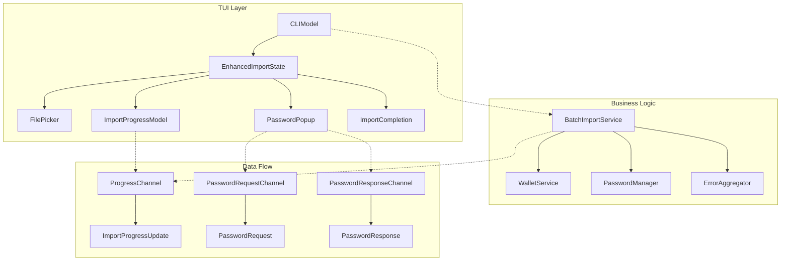
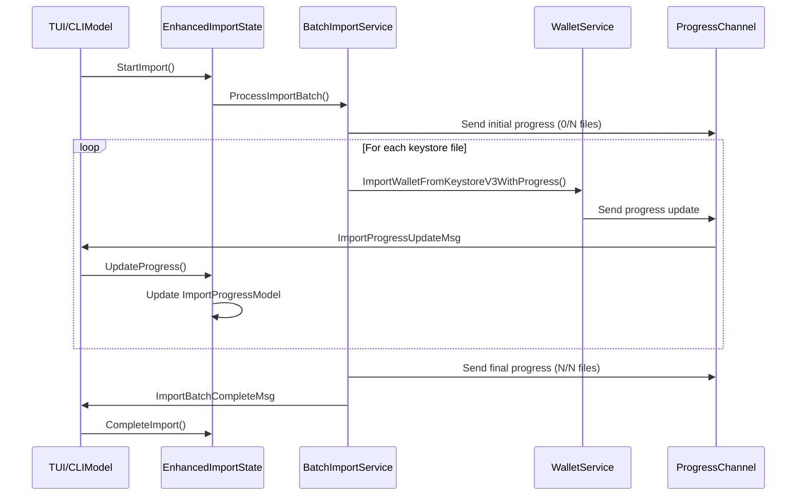
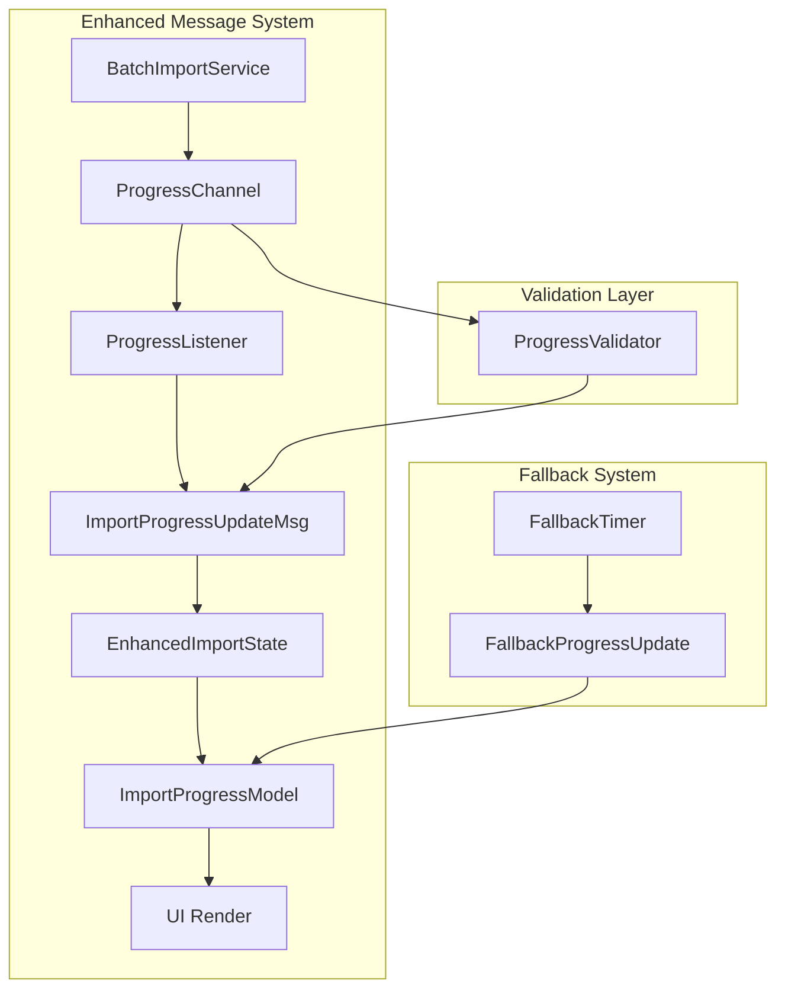

# Import KeyStoreV3 Progress Update Design

## Overview

This design addresses the issue where the progress bar and keystore information are not being properly updated during the import of multiple KeyStoreV3 files in the BLOCO Wallet Manager TUI application. The current implementation shows static information (0 wallets, 0% progress) even when import operations are running, preventing users from tracking the actual progress of their batch import operations.

## Architecture

### Current System Components

The current system consists of several interconnected components for handling keystore imports:



### Message Flow System

The TUI uses a Bubble Tea message-based architecture where progress updates flow through specific message types:



## Problem Analysis

### Root Cause Identification

Based on the codebase analysis, the progress update issue stems from several potential problems:

1. **Message Routing Gaps**: The `ImportProgressUpdateMsg` messages may not be properly routed to the `ImportProgressModel` component
2. **Channel Communication Issues**: The progress channel communication between `BatchImportService` and UI components may have timing or blocking issues
3. **State Synchronization Problems**: The `EnhancedImportState` may not be properly synchronizing progress updates with the UI rendering
4. **Bubble Tea Update Chain Breaks**: The progress messages may not be flowing through the complete Bubble Tea update chain

### Current Implementation Issues

The current implementation has these specific issues:

#### Issue 1: Progress Channel Timeout
```go
// In batch_import_service.go - potential blocking issue
func (ws *WalletService) sendProgressUpdate(progressChan chan<- ImportProgress, progress ImportProgress) {
    select {
    case progressChan <- progress:
        // Successfully sent progress update
    case <-time.After(100 * time.Millisecond):
        // Timeout after 100ms - progress update lost
    }
}
```

#### Issue 2: Message Processing Chain
The update chain in `tui.go` may not be properly handling `ImportProgressUpdateMsg`:

```go
// Current implementation may miss progress updates
case ImportProgressUpdateMsg:
    m.enhancedImportState.UpdateProgress(msg.Progress)
    // Missing: Command to continue listening
    return m, nil // Should return listening command
```

#### Issue 3: Progress Bar State Management
The `ImportProgressModel` may not be receiving the correct message types or the progress percentage calculation may be incorrect.

## Solution Design

### Enhanced Progress Update Architecture

#### 1. Improved Message Flow System

Implement a more robust message flow system that ensures progress updates are reliably delivered and processed:



#### 2. Progress Update Message Enhancement

Enhance the progress update messages to include more comprehensive information:

```go
type EnhancedImportProgressMsg struct {
    // Core progress information
    CurrentFile     string
    ProcessedFiles  int
    TotalFiles      int
    Percentage      float64
    
    // Timing information
    StartTime       time.Time
    ElapsedTime     time.Duration
    EstimatedTotal  time.Duration
    
    // Status information
    Status          ImportStatus
    PauseReason     string
    
    // Error tracking
    Errors          []ImportError
    PendingPassword bool
    PendingFile     string
    
    // Validation
    MessageID       string
    Timestamp       time.Time
}

type ImportStatus int

const (
    StatusInitializing ImportStatus = iota
    StatusProcessing
    StatusPaused
    StatusCompleted
    StatusError
    StatusCancelled
)
```

#### 3. Enhanced Progress Channel Management

Implement a buffered progress channel system with guaranteed delivery:

```go
type ProgressChannelManager struct {
    mainChannel    chan ImportProgress
    backupChannel  chan ImportProgress
    listeners      []chan ImportProgressUpdateMsg
    mutex          sync.RWMutex
    closed         bool
    
    // Metrics for debugging
    sentCount      int64
    receivedCount  int64
    droppedCount   int64
}

func (pcm *ProgressChannelManager) SendProgress(progress ImportProgress) error {
    pcm.mutex.RLock()
    defer pcm.mutex.RUnlock()
    
    if pcm.closed {
        return fmt.Errorf("progress channel manager is closed")
    }
    
    // Try main channel first
    select {
    case pcm.mainChannel <- progress:
        atomic.AddInt64(&pcm.sentCount, 1)
        return nil
    case <-time.After(50 * time.Millisecond):
        // Try backup channel
        select {
        case pcm.backupChannel <- progress:
            atomic.AddInt64(&pcm.sentCount, 1)
            return nil
        default:
            atomic.AddInt64(&pcm.droppedCount, 1)
            return fmt.Errorf("progress channel full, message dropped")
        }
    }
}
```

#### 4. Progress Listener Service

Implement a dedicated progress listener service that bridges the gap between the business logic and UI:

```go
type ProgressListenerService struct {
    progressChan   <-chan ImportProgress
    uiUpdateChan   chan<- tea.Msg
    stopChan       chan struct{}
    validator      ProgressValidator
    transformer    ProgressTransformer
    isRunning      bool
    mutex          sync.RWMutex
}

func (pls *ProgressListenerService) Start() error {
    pls.mutex.Lock()
    defer pls.mutex.Unlock()
    
    if pls.isRunning {
        return fmt.Errorf("progress listener already running")
    }
    
    pls.isRunning = true
    go pls.listenLoop()
    return nil
}

func (pls *ProgressListenerService) listenLoop() {
    for {
        select {
        case progress := <-pls.progressChan:
            if err := pls.validator.Validate(progress); err != nil {
                continue // Skip invalid progress updates
            }
            
            msg := pls.transformer.Transform(progress)
            
            // Non-blocking send to UI
            select {
            case pls.uiUpdateChan <- msg:
                // Success
            case <-time.After(200 * time.Millisecond):
                // UI channel blocked, implement fallback
                pls.handleBlockedUI(msg)
            }
            
        case <-pls.stopChan:
            pls.mutex.Lock()
            pls.isRunning = false
            pls.mutex.Unlock()
            return
        }
    }
}
```

### UI Layer Enhancements

#### 1. Enhanced Import State Management

Improve the `EnhancedImportState` to better handle progress updates:

```go
func (s *EnhancedImportState) UpdateProgress(progress wallet.ImportProgress) error {
    s.mu.Lock()
    defer s.mu.Unlock()
    
    // Validate progress update
    if err := s.validateProgressUpdate(progress); err != nil {
        return fmt.Errorf("invalid progress update: %w", err)
    }
    
    // Update current progress
    s.CurrentProgress = progress
    
    // Update progress bar component
    if s.ProgressBar != nil {
        progressMsg := ImportProgressMsg{
            CurrentFile:    progress.CurrentFile,
            ProcessedFiles: progress.ProcessedFiles,
            TotalFiles:     progress.TotalFiles,
            Completed:      progress.ProcessedFiles >= progress.TotalFiles,
            Paused:         progress.PendingPassword,
            PauseReason:    progress.PendingFile,
        }
        
        // Add any errors
        if len(progress.Errors) > 0 {
            lastError := progress.Errors[len(progress.Errors)-1]
            progressMsg.Error = &ImportError{
                File:    lastError.File,
                Error:   lastError.Error,
                Skipped: lastError.Skipped,
            }
        }
        
        var cmd tea.Cmd
        *s.ProgressBar, cmd = s.ProgressBar.Update(progressMsg)
        
        // Store command for execution
        s.pendingCommand = cmd
    }
    
    return nil
}

func (s *EnhancedImportState) validateProgressUpdate(progress wallet.ImportProgress) error {
    if progress.TotalFiles <= 0 {
        return fmt.Errorf("total files must be positive")
    }
    
    if progress.ProcessedFiles < 0 || progress.ProcessedFiles > progress.TotalFiles {
        return fmt.Errorf("processed files out of range: %d (max: %d)", 
            progress.ProcessedFiles, progress.TotalFiles)
    }
    
    if progress.Percentage < 0 || progress.Percentage > 100 {
        return fmt.Errorf("percentage out of range: %.2f", progress.Percentage)
    }
    
    return nil
}
```

#### 2. Improved TUI Update Handler

Enhance the TUI update handler to properly process progress messages:

```go
func (m *CLIModel) updateEnhancedImport(msg tea.Msg) (tea.Model, tea.Cmd) {
    if m.enhancedImportState == nil {
        m.initEnhancedImport()
        return m, nil
    }

    var cmds []tea.Cmd

    switch msg := msg.(type) {
    case ImportProgressUpdateMsg:
        // Update progress in import state
        if err := m.enhancedImportState.UpdateProgress(msg.Progress); err != nil {
            m.err = fmt.Errorf("progress update error: %w", err)
            return m, nil
        }
        
        // Continue listening for more updates
        if m.enhancedImportState.GetCurrentPhase() == PhaseImporting {
            cmds = append(cmds, m.listenForProgressUpdates())
        }
        
        // Handle any pending commands from progress update
        if cmd := m.enhancedImportState.GetPendingCommand(); cmd != nil {
            cmds = append(cmds, cmd)
        }
        
        return m, tea.Batch(cmds...)
        
    case ImportBatchCompleteMsg:
        // Handle completion
        if err := m.enhancedImportState.CompleteImport(msg.Results); err != nil {
            m.err = fmt.Errorf("import completion error: %w", err)
            m.currentView = constants.DefaultView
        }
        return m, nil
        
    case ContinueListeningMsg:
        // Enhanced continue listening with validation
        if m.enhancedImportState != nil && 
           m.enhancedImportState.GetCurrentPhase() == PhaseImporting &&
           !m.enhancedImportState.IsCompleted() {
            return m, m.listenForProgressUpdates()
        }
        return m, nil
    }
    
    // Delegate to enhanced import state with command collection
    var cmd tea.Cmd
    _, cmd = m.enhancedImportState.Update(msg)
    if cmd != nil {
        cmds = append(cmds, cmd)
    }
    
    return m, tea.Batch(cmds...)
}
```

### Progress Monitoring and Debugging

#### 1. Progress Metrics Collection

Implement metrics collection for debugging progress update issues:

```go
type ProgressMetrics struct {
    TotalUpdates       int64
    SuccessfulUpdates  int64
    DroppedUpdates     int64
    InvalidUpdates     int64
    AverageLatency     time.Duration
    LastUpdateTime     time.Time
    UpdateFrequency    float64
    
    // Channel metrics
    ChannelCapacity    int
    ChannelLength      int
    ChannelBlocked     bool
    
    mutex              sync.RWMutex
}

func (pm *ProgressMetrics) RecordUpdate(duration time.Duration, success bool) {
    pm.mutex.Lock()
    defer pm.mutex.Unlock()
    
    pm.TotalUpdates++
    pm.LastUpdateTime = time.Now()
    
    if success {
        pm.SuccessfulUpdates++
        
        // Update average latency (exponential moving average)
        if pm.AverageLatency == 0 {
            pm.AverageLatency = duration
        } else {
            pm.AverageLatency = time.Duration(
                0.9*float64(pm.AverageLatency) + 0.1*float64(duration))
        }
    } else {
        pm.DroppedUpdates++
    }
    
    // Calculate update frequency (updates per second)
    if pm.TotalUpdates > 1 {
        timeDiff := time.Since(pm.LastUpdateTime)
        pm.UpdateFrequency = float64(pm.TotalUpdates) / timeDiff.Seconds()
    }
}
```

#### 2. Progress Update Validation

Implement comprehensive validation for progress updates:

```go
type ProgressValidator struct {
    lastProgress   *wallet.ImportProgress
    tolerance      float64
    mutex          sync.RWMutex
}

func (pv *ProgressValidator) Validate(progress wallet.ImportProgress) error {
    pv.mutex.Lock()
    defer pv.mutex.Unlock()
    
    // Basic validation
    if err := pv.validateBasicFields(progress); err != nil {
        return err
    }
    
    // Consistency validation with previous progress
    if pv.lastProgress != nil {
        if err := pv.validateConsistency(progress, *pv.lastProgress); err != nil {
            return err
        }
    }
    
    // Timing validation
    if err := pv.validateTiming(progress); err != nil {
        return err
    }
    
    pv.lastProgress = &progress
    return nil
}

func (pv *ProgressValidator) validateBasicFields(progress wallet.ImportProgress) error {
    if progress.TotalFiles <= 0 {
        return fmt.Errorf("total files must be positive: %d", progress.TotalFiles)
    }
    
    if progress.ProcessedFiles < 0 {
        return fmt.Errorf("processed files cannot be negative: %d", progress.ProcessedFiles)
    }
    
    if progress.ProcessedFiles > progress.TotalFiles {
        return fmt.Errorf("processed files exceeds total: %d > %d", 
            progress.ProcessedFiles, progress.TotalFiles)
    }
    
    expectedPercentage := float64(progress.ProcessedFiles) / float64(progress.TotalFiles) * 100
    if math.Abs(progress.Percentage-expectedPercentage) > pv.tolerance {
        return fmt.Errorf("percentage inconsistent: %.2f vs expected %.2f", 
            progress.Percentage, expectedPercentage)
    }
    
    return nil
}

func (pv *ProgressValidator) validateConsistency(current, previous wallet.ImportProgress) error {
    // Processed files should not decrease
    if current.ProcessedFiles < previous.ProcessedFiles {
        return fmt.Errorf("processed files decreased: %d -> %d", 
            previous.ProcessedFiles, current.ProcessedFiles)
    }
    
    // Total files should remain consistent
    if current.TotalFiles != previous.TotalFiles {
        return fmt.Errorf("total files changed: %d -> %d", 
            previous.TotalFiles, current.TotalFiles)
    }
    
    return nil
}
```

## Testing Strategy

### Unit Testing

Implement comprehensive unit tests for the enhanced progress system:

```go
func TestProgressUpdateFlow(t *testing.T) {
    // Test progress channel communication
    t.Run("ProgressChannelCommunication", func(t *testing.T) {
        pcm := NewProgressChannelManager(100) // buffered channel
        defer pcm.Close()
        
        progress := wallet.ImportProgress{
            CurrentFile:    "test.json",
            ProcessedFiles: 1,
            TotalFiles:     5,
            Percentage:     20.0,
        }
        
        err := pcm.SendProgress(progress)
        assert.NoError(t, err)
        
        received := <-pcm.mainChannel
        assert.Equal(t, progress.CurrentFile, received.CurrentFile)
        assert.Equal(t, progress.ProcessedFiles, received.ProcessedFiles)
    })
    
    // Test progress listener service
    t.Run("ProgressListenerService", func(t *testing.T) {
        progressChan := make(chan wallet.ImportProgress, 10)
        uiChan := make(chan tea.Msg, 10)
        
        pls := NewProgressListenerService(progressChan, uiChan)
        err := pls.Start()
        assert.NoError(t, err)
        defer pls.Stop()
        
        // Send progress update
        progress := wallet.ImportProgress{
            CurrentFile:    "test.json",
            ProcessedFiles: 1,
            TotalFiles:     5,
        }
        
        progressChan <- progress
        
        // Verify UI receives update
        select {
        case msg := <-uiChan:
            progressMsg, ok := msg.(ImportProgressUpdateMsg)
            assert.True(t, ok)
            assert.Equal(t, progress.CurrentFile, progressMsg.Progress.CurrentFile)
        case <-time.After(time.Second):
            t.Fatal("Progress update not received by UI")
        }
    })
}

func TestEnhancedImportStateProgress(t *testing.T) {
    mockBatchService := &MockBatchImportService{}
    styles := Styles{}
    
    state := NewEnhancedImportState(mockBatchService, styles)
    
    // Test progress update handling
    progress := wallet.ImportProgress{
        CurrentFile:    "wallet1.json",
        ProcessedFiles: 1,
        TotalFiles:     3,
        Percentage:     33.33,
    }
    
    err := state.UpdateProgress(progress)
    assert.NoError(t, err)
    
    // Verify progress bar was updated
    assert.Equal(t, "wallet1.json", state.ProgressBar.currentFile)
    assert.Equal(t, 1, state.ProgressBar.processedFiles)
    assert.Equal(t, 3, state.ProgressBar.totalFiles)
}
```

### Integration Testing

Implement integration tests that simulate the complete progress update flow:

```go
func TestProgressUpdateIntegration(t *testing.T) {
    // Create a test environment
    testDir := createTestKeystoreDirectory(t)
    defer os.RemoveAll(testDir)
    
    // Initialize components
    batchService := wallet.NewBatchImportService(nil, nil)
    styles := getTestStyles()
    state := NewEnhancedImportState(batchService, styles)
    
    // Create progress channels
    progressChan := make(chan wallet.ImportProgress, 100)
    
    // Start progress monitoring
    var receivedUpdates []wallet.ImportProgress
    var updateMutex sync.Mutex
    
    go func() {
        for progress := range progressChan {
            updateMutex.Lock()
            receivedUpdates = append(receivedUpdates, progress)
            updateMutex.Unlock()
            
            // Update state
            err := state.UpdateProgress(progress)
            assert.NoError(t, err)
        }
    }()
    
    // Simulate batch import
    keystoreFiles := getTestKeystoreFiles(testDir)
    jobs, err := batchService.CreateImportJobsFromFiles(keystoreFiles)
    assert.NoError(t, err)
    
    // Process import with progress tracking
    results := batchService.ProcessImportBatch(jobs, progressChan, nil, nil)
    
    // Wait for processing to complete
    time.Sleep(100 * time.Millisecond)
    close(progressChan)
    
    // Verify progress updates were received
    updateMutex.Lock()
    assert.True(t, len(receivedUpdates) > 0)
    
    // Verify initial progress
    firstUpdate := receivedUpdates[0]
    assert.Equal(t, 0, firstUpdate.ProcessedFiles)
    assert.Equal(t, len(keystoreFiles), firstUpdate.TotalFiles)
    
    // Verify final progress
    lastUpdate := receivedUpdates[len(receivedUpdates)-1]
    assert.Equal(t, len(keystoreFiles), lastUpdate.ProcessedFiles)
    assert.Equal(t, 100.0, lastUpdate.Percentage)
    updateMutex.Unlock()
    
    // Verify UI state
    assert.True(t, state.ProgressBar.IsCompleted())
    assert.Equal(t, len(keystoreFiles), state.ProgressBar.processedFiles)
}
```

### Manual Testing Scenarios

Create manual testing scenarios to verify the progress update system:

#### Test Scenario 1: Normal Progress Flow
1. Start the application
2. Navigate to enhanced keystore import
3. Select multiple keystore files (5-10 files)
4. Initiate import
5. **Expected**: Progress bar should update in real-time showing current file and percentage
6. **Verify**: Progress statistics should show correct counts and timing

#### Test Scenario 2: Password Input Interruption
1. Include keystores requiring manual password input
2. Start import process
3. **Expected**: Progress should pause when password is required
4. **Expected**: Progress should resume after password entry
5. **Verify**: Total elapsed time should account for pause duration

#### Test Scenario 3: Error Handling
1. Include corrupted or invalid keystore files
2. Start import process
3. **Expected**: Progress should continue despite errors
4. **Expected**: Error count should increment correctly
5. **Verify**: Final summary should show correct success/error counts

#### Test Scenario 4: Large Batch Performance
1. Test with 50+ keystore files
2. Monitor progress update frequency
3. **Expected**: Updates should be smooth without UI freezing
4. **Verify**: Progress should complete without dropping updates