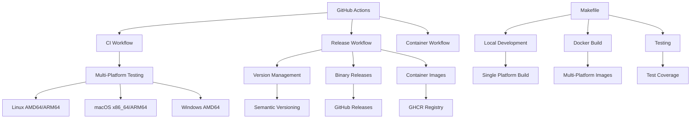
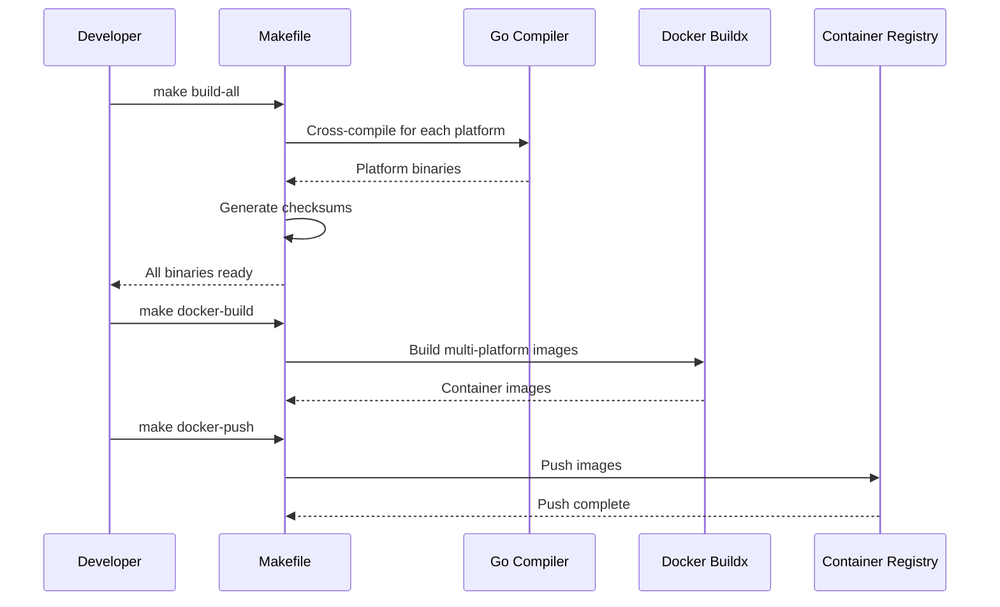
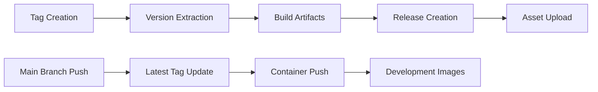
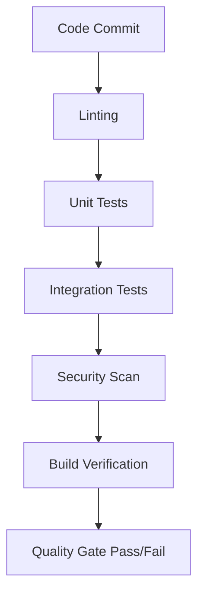
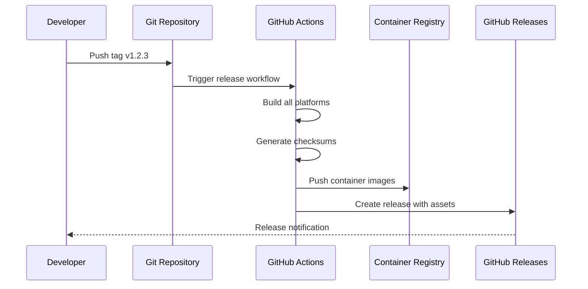

# Makefile and GitHub Actions Setup Design

## Overview

This document outlines the design for implementing a comprehensive build system for the bloco-wallet-manager project. The system includes a Makefile for local development and CI/CD pipelines using GitHub Actions for automated building, testing, and releasing across multiple platforms.

## Technology Stack & Dependencies

- **Build Tool**: Make
- **CI/CD Platform**: GitHub Actions
- **Container Platform**: Docker with Buildx
- **Target Platforms**: linux/amd64, linux/arm64, darwin/amd64, darwin/arm64, windows/amd64
- **Go Version**: 1.24.3 (as specified in go.mod)
- **Container Registry**: GitHub Container Registry (ghcr.io)

## Architecture

### Build System Architecture



### Platform Build Matrix

| Platform | Architecture | Build Target | Output Format |
|----------|-------------|--------------|---------------|
| Linux | AMD64 | linux/amd64 | Binary + Container |
| Linux | ARM64 | linux/arm64 | Binary + Container |
| macOS | x86_64 | darwin/amd64 | Binary |
| macOS | ARM64 | darwin/arm64 | Binary |
| Windows | AMD64 | windows/amd64 | Binary (.exe) |

## Makefile Design

### Core Variables and Configuration

```makefile
# Project Configuration
NAME            := bloco-wallet
VERSION         ?= $(shell git describe --tags --always --dirty)
PACKAGE         := blocowallet
OUTPUT_BIN      ?= build/${NAME}
GO_FLAGS        ?=
GO_TAGS         ?= netgo
CGO_ENABLED     ?= 0
GIT_REV         ?= $(shell git rev-parse --short HEAD)
GIT_BRANCH      ?= $(shell git rev-parse --abbrev-ref HEAD)

# Container Configuration
IMG_NAME        := ghcr.io/italoag/${NAME}
IMAGE           := ${IMG_NAME}:${VERSION}
BUILD_PLATFORMS ?= linux/amd64,linux/arm64

# Build Matrix for Cross-Compilation
PLATFORMS       := linux/amd64 linux/arm64 darwin/amd64 darwin/arm64 windows/amd64
```

### Build Targets

#### Primary Build Targets

- **`build`**: Standard single-platform build for development
- **`build-all`**: Cross-platform build for all supported architectures
- **`clean`**: Clean build artifacts and temporary files
- **`test`**: Run complete test suite with coverage
- **`lint`**: Code quality checks and linting

#### Container Targets

- **`docker-build`**: Build multi-platform container images
- **`docker-push`**: Push images to container registry
- **`docker-run`**: Run container locally for testing

#### Release Targets

- **`release-prep`**: Prepare release artifacts
- **`release-local`**: Create local release package
- **`checksums`**: Generate SHA256 checksums for binaries

### Build Process Flow



## GitHub Actions Workflows

### Workflow Architecture

#### 1. Continuous Integration Workflow

**Trigger**: Push to any branch, Pull Request to main
**File**: `.github/workflows/ci.yml`

**Workflow Steps**:
1. **Setup**: Checkout code, setup Go environment
2. **Cache**: Cache Go modules and build cache
3. **Lint**: Run golangci-lint across codebase
4. **Test**: Execute test suite with coverage reporting
5. **Build**: Cross-compile for all platforms
6. **Artifacts**: Upload build artifacts for testing

#### 2. Release Workflow

**Trigger**: Push of tag matching `v*.*.*` pattern
**File**: `.github/workflows/release.yml`

**Workflow Steps**:
1. **Validation**: Verify tag format and branch
2. **Build**: Cross-compile all platform binaries
3. **Container**: Build and push multi-platform images
4. **Checksums**: Generate SHA256 checksums
5. **Release**: Create GitHub release with assets
6. **Notification**: Optional notification to team

#### 3. Container Workflow

**Trigger**: Push to main branch, manual dispatch
**File**: `.github/workflows/container.yml`

**Workflow Steps**:
1. **Setup**: Configure Docker Buildx
2. **Login**: Authenticate to GitHub Container Registry
3. **Build**: Multi-platform container build
4. **Push**: Push images with latest and version tags
5. **Security**: Run container security scanning

### Version Management Strategy

#### Semantic Versioning Implementation



#### Version Tagging Rules

- **Major Version** (v1.0.0): Breaking changes
- **Minor Version** (v1.1.0): New features, backward compatible
- **Patch Version** (v1.1.1): Bug fixes, backward compatible
- **Pre-release** (v1.1.0-alpha.1): Development versions

## Container Strategy

### Multi-Platform Container Build

#### Dockerfile Architecture

```dockerfile
# Multi-stage build for optimal image size
FROM --platform=$BUILDPLATFORM golang:1.24.3-alpine AS builder
FROM scratch AS runtime
```

#### Platform Support Matrix

| Platform | Base Image | Size Target | Use Case |
|----------|------------|-------------|----------|
| linux/amd64 | scratch | <20MB | Production deployment |
| linux/arm64 | scratch | <20MB | ARM-based servers |

### Container Registry Strategy

- **Primary Registry**: GitHub Container Registry (ghcr.io)
- **Image Naming**: `ghcr.io/italoag/bloco-wallet-manager`
- **Tagging Strategy**:
  - `latest`: Latest stable release
  - `v1.2.3`: Specific version tags
  - `main`: Development builds from main branch

## Security and Quality Assurance

### Security Measures

#### Build Security

- **Dependency Scanning**: Automated vulnerability scanning
- **Container Scanning**: Security analysis of container images
- **Code Signing**: Digital signatures for release binaries
- **SBOM Generation**: Software Bill of Materials for releases

#### Access Control

- **Registry Access**: Restricted push access to GitHub Container Registry
- **Release Process**: Protected main branch with required reviews
- **Secrets Management**: GitHub Secrets for sensitive data

### Quality Gates

#### Code Quality Checks



#### Test Coverage Requirements

- **Minimum Coverage**: 80% code coverage
- **Critical Paths**: 95% coverage for crypto and wallet operations
- **Integration Tests**: End-to-end workflow validation

## Release Automation

### Automated Release Process

#### Release Trigger Flow



#### Release Asset Generation

**Binary Assets**:
- `bloco-wallet-manager-v1.2.3-linux-amd64.tar.gz`
- `bloco-wallet-manager-v1.2.3-linux-arm64.tar.gz`
- `bloco-wallet-manager-v1.2.3-darwin-amd64.tar.gz`
- `bloco-wallet-manager-v1.2.3-darwin-arm64.tar.gz`
- `bloco-wallet-manager-v1.2.3-windows-amd64.zip`

**Verification Assets**:
- `checksums.txt`: SHA256 checksums for all binaries
- `checksums.txt.sig`: GPG signature for checksums file

### Change Management

#### Version Bumping Strategy

1. **Manual Tagging**: Developer creates semantic version tag
2. **Automated Detection**: GitHub Actions detects tag push
3. **Version Injection**: Build process injects version into binary
4. **Release Notes**: Auto-generated from commit messages and PRs

## Testing Strategy

### Multi-Platform Testing

#### Test Matrix Configuration

```yaml
strategy:
  matrix:
    os: [ubuntu-latest, macos-latest, windows-latest]
    go-version: [1.24.3]
    include:
      - os: ubuntu-latest
        platforms: linux/amd64,linux/arm64
      - os: macos-latest
        platforms: darwin/amd64,darwin/arm64
      - os: windows-latest
        platforms: windows/amd64
```

#### Test Categories

- **Unit Tests**: Component-level testing
- **Integration Tests**: Cross-component interaction testing
- **End-to-End Tests**: Complete workflow validation
- **Performance Tests**: Crypto operation benchmarks
- **Security Tests**: Vulnerability and penetration testing

### Continuous Testing

#### Pre-commit Testing

- **Local Testing**: Make targets for developer testing
- **Git Hooks**: Optional pre-commit and pre-push hooks
- **IDE Integration**: Test runner integration for development

#### CI/CD Testing

- **Pull Request Testing**: Full test suite on PR creation
- **Branch Protection**: Required status checks before merge
- **Regression Testing**: Automated testing on main branch

## Performance Optimization

### Build Performance

#### Optimization Strategies

- **Parallel Builds**: Concurrent cross-compilation
- **Build Caching**: Go module and build cache optimization
- **Container Layer Caching**: Docker layer caching for faster builds
- **Artifact Caching**: Reuse of build artifacts across workflows

#### Performance Metrics

- **Build Time Target**: <5 minutes for full multi-platform build
- **Test Execution**: <3 minutes for complete test suite
- **Container Build**: <10 minutes for multi-platform images

### Resource Management

#### GitHub Actions Limits

- **Concurrent Jobs**: Optimize for GitHub Actions concurrency limits
- **Storage Usage**: Efficient artifact and cache management
- **Bandwidth**: Optimize image push/pull operations

## Monitoring and Observability

### Build Monitoring

#### Metrics Collection

- **Build Success Rate**: Track build failure patterns
- **Build Duration**: Monitor build performance trends
- **Test Coverage**: Track coverage metrics over time
- **Security Vulnerabilities**: Monitor and alert on security issues

#### Alerting Strategy

- **Build Failures**: Immediate notification to development team
- **Security Alerts**: High-priority alerts for vulnerabilities
- **Performance Degradation**: Alerts for build time increases

### Operational Monitoring

#### Container Monitoring

- **Image Size Tracking**: Monitor image size growth
- **Vulnerability Scanning**: Continuous security monitoring
- **Registry Usage**: Track storage and bandwidth usage

## Implementation Phases

### Phase 1: Foundation (Week 1)

- [ ] Create comprehensive Makefile
- [ ] Implement basic CI workflow
- [ ] Setup cross-compilation for all platforms
- [ ] Configure GitHub Container Registry

### Phase 2: Automation (Week 2)

- [ ] Implement release automation workflow
- [ ] Setup container multi-platform builds
- [ ] Configure security scanning
- [ ] Create release asset generation

### Phase 3: Enhancement (Week 3)

- [ ] Add performance monitoring
- [ ] Implement advanced testing strategies
- [ ] Setup notification systems
- [ ] Create documentation and runbooks

### Phase 4: Optimization (Week 4)

- [ ] Optimize build performance
- [ ] Implement caching strategies
- [ ] Add security enhancements
- [ ] Create monitoring dashboards